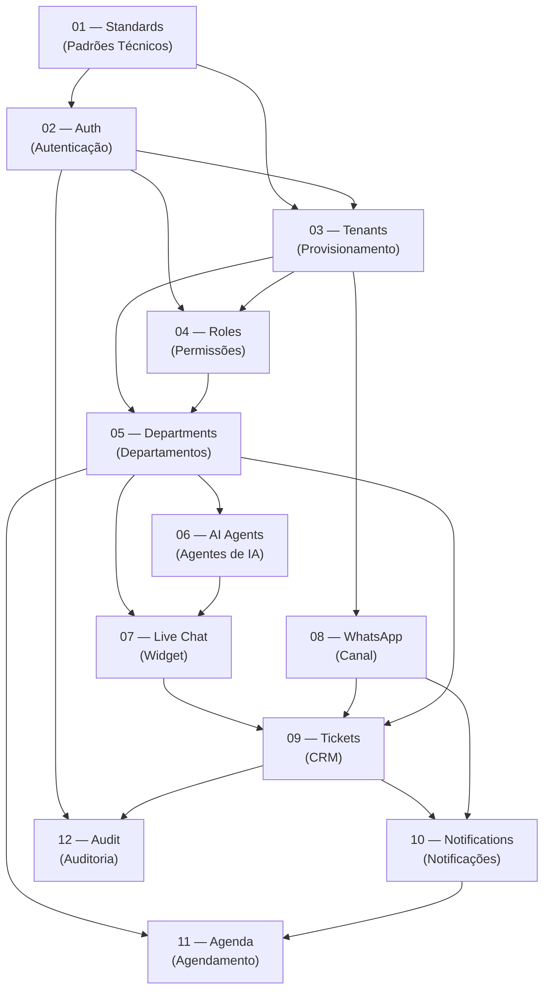

# DEPENDENCIES — Grafo de Dependências entre Specs

Este documento mapeia as dependências entre specs para orientar a implementação paralela por múltiplos agentes. Um agente **não deve iniciar** a implementação de uma spec enquanto suas dependências não estiverem completas.

---

## Grafo de Dependências

---

## Tabela de Dependências

| Spec | Nome | Depende de |
|---|---|---|
| **01** | Standards | *(nenhuma — leitura obrigatória antes de qualquer implementação)* |
| **02** | Auth | 01 |
| **03** | Tenants | 01, 02 |
| **04** | Roles | 02, 03 |
| **05** | Departments | 03, 04 |
| **06** | AI Agents | 05 |
| **07** | Live Chat | 05, 06 — ✅ COMPLETE (V1: backend, widget, CRM config, CRM inbox, lifecycle jobs, attachments) |
| **08** | WhatsApp | 02, 03, 04, 06, 07 — ✅ BACKEND COMPLETE (US1-US6 entregues; Polish parcial; frontend Angular + integration tests Testcontainers pendentes). Detalhes em [specs/008-whatsapp-channel/tasks.md](../specs/008-whatsapp-channel/tasks.md). |
| **09** | Tickets | 05, 07, 08 |
| **10** | Notifications | 08, 09 |
| **11** | Agenda | 05, 10 |
| **12** | Audit | 02, 09 |

---

## Grupos de Implementação Paralela

Com base no grafo acima, os módulos podem ser desenvolvidos em paralelo dentro de cada grupo. Um grupo só começa quando o anterior está completo.

| Grupo | Specs | Pode paralizar? |
|---|---|---|
| **G0 — Fundação** | 02 (Standards) | — |
| **G1 — Core de Segurança** | 03 (Auth), em sequência → 03 (Tenants) | Não (01 antes de 02) |
| **G2 — Estrutura Organizacional** | 05 (Roles) + 05 (Departments) | Parcialmente (03 e 04 em sequência) |
| **G3 — Canais** | 07 (AI Agents) + 08 (WhatsApp) | ✅ Paralelo |
| **G4 — Canal Live Chat** | 08 (Live Chat) | Aguarda G3 |
| **G5 — CRM** | 10 (Tickets) | Aguarda G4 | ✅ **Implementado** (Spec 009) |
| **G6 — Comunicação e Agenda** | 11 (Notifications) + 11 (Agenda) | ✅ Paralelo após G5 |
| **G7 — Observabilidade** | 12 (Audit) | ✅ Paralelo com G6 |

---

## Sobre o Uso com Multi-Agentes

Ao distribuir implementação entre múltiplos agentes simultaneamente:

1. **Respeite os grupos** — nunca inicie um grupo sem o anterior concluído
2. **Contratos de API primeiro** — antes de dois agentes implementarem módulos que se comunicam, defina o contrato da API (endpoints, DTOs) antes de implementar os dois lados
3. **Banco de dados compartilhado** — as migrations de cada módulo devem ser versionadas com timestamp para evitar conflitos
4. **Entidades compartilhadas** — entidades usadas por múltiplos módulos (ex: `tickets`, `contacts`) devem ser implementadas no módulo-dono e apenas referenciadas nos demais
5. **Feature flags** — ao integrar, usar a tabela de dependências para validar se o módulo base já está funcional antes de ativar o módulo dependente

---

> **Nota:** Este documento deve ser atualizado caso novas specs sejam adicionadas ou dependências sejam identificadas durante a implementação.
